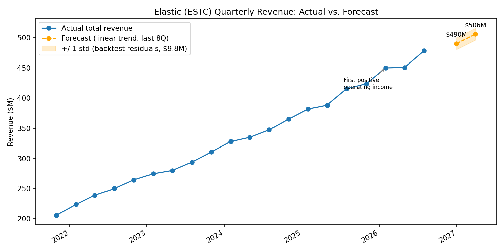
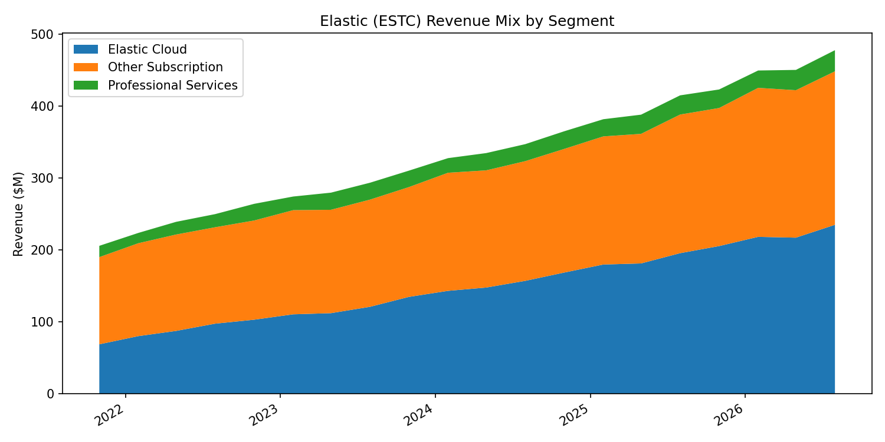

# Elastic (ESTC) Revenue Trend & Forecast

## Business Question
How is Elastic's revenue trending by segment, and what would a validated trend-based forecast project for the next two quarters?

**Data current through:** Q1 FY2027 (period ending 2026-07-31). Elastic's fiscal year ends April 30, quarters end Jul 31 / Oct 31 / Jan 31 / Apr 30 (verified against Elastic's SEC 10-K/10-Q filings), so the next report (Q2 FY2027, period ending 2026-10-31) isn't due until after that quarter closes.

## Dataset
- **Source:** Elastic's own public quarterly financial disclosures ([ir.elastic.co](https://ir.elastic.co/financials/quarterly-results/default.aspx), compiled via [stockanalysis.com](https://stockanalysis.com/stocks/estc/financials/?p=quarterly)): real numbers, not synthetic.
- **Size:** 20 quarters (Q2 FY2022 to Q1 FY2027), `data/elastic_quarterly_revenue.csv`.
- **Description:** Total revenue, YoY growth %, gross profit, operating income, and revenue by segment (Elastic Cloud / Other Subscription / Professional Services).

## Tools Used
- Python (pandas, numpy): data loading, validation, trend calculations
- scikit-learn (LinearRegression): 8-quarter trend forecast, 12/8 backtest
- matplotlib: revenue trend/forecast chart with uncertainty band, revenue-mix stacked chart

## Key Findings
1. Revenue growth is decelerating on a larger base: the last 4 quarters averaged **16.2% YoY**, down from **17.4%** the 4 quarters before, a 1.2pt slowdown, but dollar net-new revenue is still growing every quarter.
2. Elastic Cloud now makes up **49.2%** of total revenue, up from 46.2% eight quarters ago, and gross margin has risen alongside it, consistent with cloud being the higher-margin offering.
3. Gross margin sits at **74.6%**, in line with typical infra/search SaaS margins, and operating income turned positive for the first time in this dataset in Q3 2026.
4. Latest quarter (Q1 FY2027): **$478.1M** revenue. Forecast for the next 2 quarters: **$490.1M**, then **$505.9M** (+/-$9.8M, from the backtest below).

## Backtest: is the forecast actually any good?
Trained on the first 12 quarters, predicted the remaining 8 held-out quarters, scored against actuals:

| Metric | Result |
|---|---|
| MAPE (8 held-out quarters) | **3.4%** |
| Residual std (used as the forecast's +/-1 std band) | **$9.8M** |

This is the difference between a model that's *fitted* and one that's *validated*: the number above says what the linear-trend approach's error rate looks like on data it never saw, not just how well it fits the data it was built on.

## Charts





## Recommendations
- Track cloud revenue share as a leading indicator: a stalled or reversed quarter there would be an early signal worth flagging before it shows up in the headline growth rate.
- Judge growth deceleration by dollar net-new revenue per quarter, not just the YoY percentage, since a slowing rate on a larger base is expected and not automatically a bad sign.
- Re-run the forecast every quarter against the newest trailing 8, and re-run the backtest periodically too: the forecast-vs-actual gap is itself a useful signal for when a pipeline-based forecasting model becomes worth building instead of a linear trend.

## What I'd do with real pipeline data
This model only sees historical revenue. A RevOps team has pipeline: open opportunities by stage, stage-conversion rates, rep-level coverage ratios. The natural next step (see the companion [`crm-pipeline-analysis`](https://github.com/VijayChamakuri/crm-pipeline-analysis) repo for the pipeline-side building blocks) is a bookings-based forecast, weighted pipeline (stage probability times open amount) as a leading indicator, reconciled against this trailing-revenue trend as a lagging check on it.

## Files
- `data/elastic_quarterly_revenue.csv`: source data
- `analyze.py`: validation, trend calculations, backtest, forecast, chart generation
- `output/revenue_trend_forecast.png`, `output/revenue_mix.png`: charts
- `output/exec_summary.md`: full write-up with all computed numbers, regenerated on every run

## Methodology
`analyze.py` validates the input (row count, no nulls, positive revenue, segments sum to total, dates sorted) before any analysis runs. Cloud-mix and margin trends are computed directly from the reported segment data. The forecast fits an ordinary least-squares linear regression on the trailing 8 quarters, then projects 2 quarters forward; a separate 12-quarter-train / 8-quarter-test backtest (above) validates the approach on held-out data rather than just reporting how well it fits its own training window.

**Limitations, stated plainly:** this is a straight-line trend fit, not a real revenue-ops forecasting model. No seasonality term, no pipeline/bookings input, no macro adjustment. It will systematically miss around inflection points (a large enterprise deal, a pricing change). Good enough to sanity-check a trend line and quote an honest error rate (3.4% MAPE) alongside it; a production forecast would need pipeline coverage ratios and stage-weighted bookings, not just historical revenue extrapolation.

## Run it
```bash
python -m venv .venv && source .venv/bin/activate
pip install -r requirements.txt
python analyze.py
```
Tested on Python 3.9 and 3.12.

## License
MIT, see [LICENSE](LICENSE).
